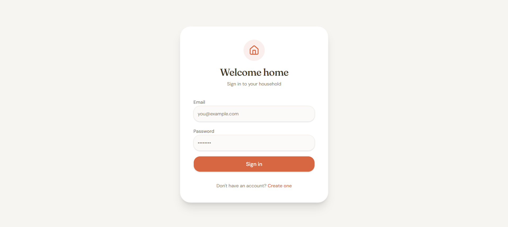
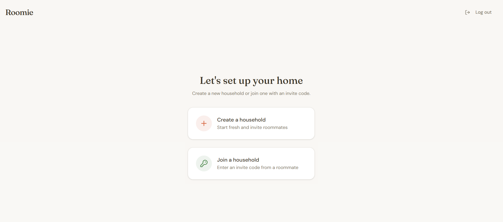
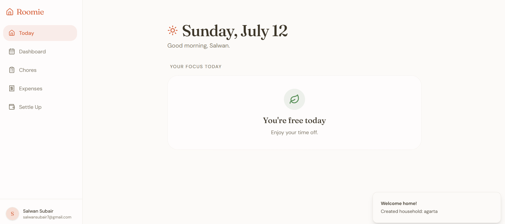
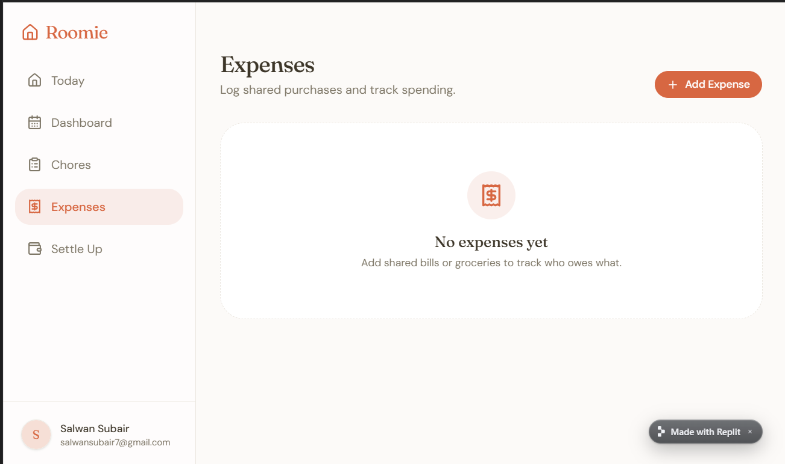

# Roomie

Chore rotation and expense splitting for shared households.

**([https://your-app-name.vercel.app](https://roomie-api-server-h9lru708o-salwan-subairs-projects.vercel.app/login))** · Built with React, Express, Postgres

## Overview

Splitting chores and shared expenses in a house full of roommates usually means a 
messy spreadsheet, a group chat nobody checks, or just arguments. Roomie fixes that: 
an admin sets up the chore rotation once, members get a simple daily view of what's 
theirs to do, and shared expenses are automatically simplified down to "who pays whom" 
instead of a tangle of IOUs.

Any household can sign up — it's not built for one specific house, it's a self-serve 
product where anyone can create a household and invite roommates in.

## Features

- **Rotating chore assignments** — admin sets the rotation order and frequency per chore; 
  the schedule advances automatically
- **One-tap daily confirm** — members see today's chore and mark it done, no clutter
- **Shared dashboard** — everyone in the household sees the current schedule, upcoming 
  assignments, and history
- **Expense splitting** — log a shared expense, split it evenly or among specific people
- **Debt simplification** — balances are netted down to the minimum number of transactions 
  needed to settle up, not a full pairwise ledger
- **Household-based accounts** — create a household or join one via invite code; no 
  hardcoded users

## Screenshots

| | |
|---|---|
|  *Simple email/password auth* |  *Households are self-serve — create one or join with a code* |
|  *Daily view: what's yours to do today* |  *Debts simplified to the minimum number of transactions* |

## Tech Stack

- **Frontend**: React (Vite), TanStack Query, Wouter
- **Backend**: Express 5
- **Database**: PostgreSQL (Neon), Drizzle ORM
- **Sessions**: express-session with Postgres-backed session store
- **Monorepo**: pnpm workspaces
- **Deployment**: Vercel (serverless functions + static frontend)

## Architecture

This is a pnpm monorepo:

```
artifacts/roomie        → React frontend (Vite)
artifacts/api-server    → Express backend, esbuild-bundled
lib/db                  → Drizzle ORM schema + Postgres pool
lib/api-client-react    → Generated API client + React Query hooks
```

The frontend and backend are deployed together on Vercel — the Express app runs as a 
single serverless function, and API requests are routed to it via rewrites while all 
other routes serve the React SPA.

## Getting Started Locally

```bash
# Clone the repo
git clone https://github.com/<your-username>/roomie.git
cd roomie

# Install dependencies
pnpm install

# Set up environment variables
# Create a .env file with:
# DATABASE_URL=your_postgres_connection_string
# SESSION_SECRET=any_random_string

# Run the dev server
pnpm dev
```

## Roadmap

- [ ] Notifications (email/push) for today's assigned chore
- [ ] Chore completion history and stats per member
- [ ] Support for recurring custom-day schedules (e.g. every other week)
- [ ] Mobile app

